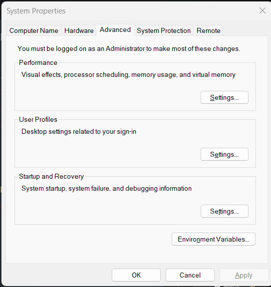
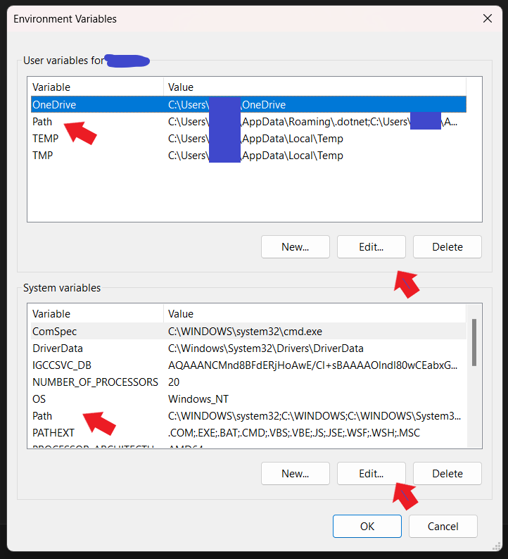
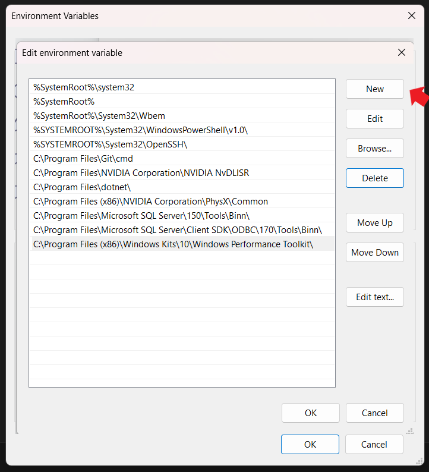
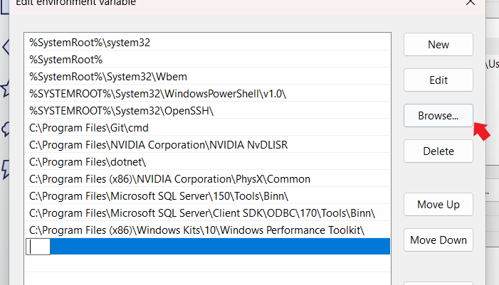
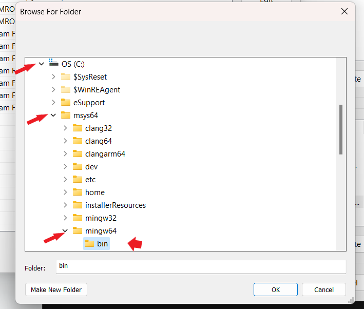

# jhoney's Windows notes #

### Quick Links
- [Home](../README.md)
- [Basic Algo Prompts](../BasicAlgorithmPromts.md)

### Other Examples/Sources
- [c-sharppcorner](https://www.c-sharpcorner.com/article/how-to-addedit-path-environment-variable-in-windows-11/)

## Adding to the PATH (Windows 11) ##
> This is an example of adding MYSYS2 to the PATH to make things like `gcc --version` available to CLI tools 
  The same process applies to dotnet or any other things you might want to add to the path 
  You can also add other helpful environment variables you might see this used on remote machines like servers 
  
  Note: sometimes a reboot is required before a CLI will see new things on the PATH

